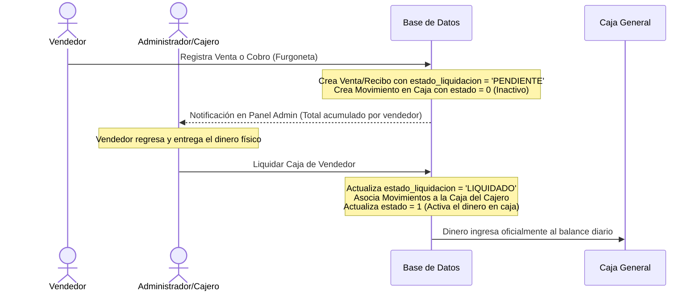

# Propuesta de Arquitectura: Ventas y Cobranzas Móviles en Furgoneta

Este documento presenta el análisis técnico y la propuesta de diseño para implementar el registro de ventas y cobros realizados por vendedores desde furgonetas (ruta), asegurando que el dinero recaudado **no se agregue a la caja general de inmediato**, sino que quede retenido en estado "pendiente" hasta que el administrador realice el proceso de liquidación.

> [!IMPORTANT]
> Siguiendo sus instrucciones, **no se ha realizado ninguna modificación en el código fuente actual**. Este documento sirve como guía detallada de desarrollo y diseño de base de datos para la implementación futura.

---

## 1. Análisis del Flujo Actual

Actualmente, el sistema registra las operaciones de la siguiente manera:

1. **Ventas (`VentaController@generar_venta`):**
   - Crea un registro en `ventas` y sus productos en `detalle_venta`.
   - Llama a `FuncionesController@generar_movimiento`, el cual obtiene la sesión de caja activa del usuario (`Caja::where('user_id', ...)->first()`) y crea un registro en `movimientos` con `estado = 1` (activo). Esto suma el monto de la venta directamente al saldo físico o virtual de la caja.

2. **Cobro de Créditos/Amortizaciones (`AmortizacionesController@crear`):**
   - Crea un registro en `recibos` y sus respectivos registros en `amortizaciones`.
   - Igualmente, llama a `generar_movimiento` insertando un registro en `movimientos` con `estado = 1`, aumentando de inmediato el saldo de la caja.

---

## 2. Propuesta de Arquitectura y Base de Datos

Para lograr que los registros móviles no afecten la caja actual y generen una notificación/acumulado por vendedor, se propone el siguiente diseño:

### A. Nuevos Campos en Base de Datos

Se deben añadir campos para rastrear el estado de liquidación de las ventas y cobros móviles:

| Tabla | Campo | Tipo | Descripción |
| :--- | :--- | :--- | :--- |
| `ventas` | `estado_liquidacion` | `VARCHAR` | Valores: `NO_APLICA` (venta directa en local), `PENDIENTE` (venta en ruta sin liquidar), `LIQUIDADO` (venta en ruta ya rendida en caja). |
| `recibos` | `estado_liquidacion` | `VARCHAR` | Valores: `NO_APLICA` (cobro directo en local), `PENDIENTE` (cobro en ruta sin liquidar), `LIQUIDADO` (cobro en ruta ya rendido en caja). |
| `vendedores` | `stock_location_id` | `INTEGER` (FK) | Relaciona al vendedor con su stock (furgoneta) en la tabla `stock_location` para descontar el inventario móvil de forma correcta. |

> [!TIP]
> Se pueden crear estos campos mediante migraciones de Laravel sin afectar los registros existentes, estableciendo valores por defecto (`NO_APLICA`).

### B. Diagrama del Flujo de Trabajo



---

## 3. Lógica de Implementación (Paso a Paso)

### Paso 1: Registro de la Operación en Ruta (Vendedor)

Cuando un vendedor registra una venta o un cobro desde la furgoneta:
1. En la vista móvil, se envía el parámetro `es_movil = true`.
2. **Para Ventas:**
   - Se guarda el registro en `ventas` estableciendo `estado_liquidacion = 'PENDIENTE'`.
   - Se guarda el movimiento llamando a `generar_movimiento` pero enviando el parámetro `$estado = 0` (inactivo/pendiente). Esto previene que se sume al total de caja.
3. **Para Cobros (Amortizaciones):**
   - Se guarda el registro en `recibos` estableciendo `estado_liquidacion = 'PENDIENTE'`.
   - Se registra el movimiento llamando a `generar_movimiento` con `$estado = 0`.

### Paso 2: Cálculo del Dinero en Posesión del Vendedor (Notificación)

Para mostrar al administrador cuánto dinero acumulado tiene cada vendedor en ruta, se consulta la base de datos de forma dinámica. 

#### Consulta SQL para el Panel de Control:
```sql
SELECT 
    v.id AS vendedor_id,
    v.nombre AS vendedor_nombre,
    -- Suma de ventas en efectivo/tarjeta pendientes de liquidación
    COALESCE((
        SELECT SUM(ve.monto) 
        FROM ventas ve 
        WHERE ve.vendedor_id = v.id 
          AND ve.estado_liquidacion = 'PENDIENTE' 
          AND ve.venta_estado = 1
    ), 0) AS total_ventas_pendientes,
    -- Suma de cobranzas/recibos pendientes de liquidación
    COALESCE((
        SELECT SUM(re.mont_rec) 
        FROM recibos re 
        WHERE re.vendedor_id = v.id 
          AND re.estado_liquidacion = 'PENDIENTE' 
          AND re.esta_rec = 'EMITIDO'
    ), 0) AS total_cobros_pendientes,
    -- Total general en manos del vendedor
    (
        COALESCE((SELECT SUM(ve.monto) FROM ventas ve WHERE ve.vendedor_id = v.id AND ve.estado_liquidacion = 'PENDIENTE' AND ve.venta_estado = 1), 0) +
        COALESCE((SELECT SUM(re.mont_rec) FROM recibos re WHERE re.vendedor_id = v.id AND re.estado_liquidacion = 'PENDIENTE' AND re.esta_rec = 'EMITIDO'), 0)
    ) AS total_acumulado
FROM vendedores v
WHERE v.estado = 1;
```

Esto alimentará un **Badge de Notificación** en la barra superior o en el menú lateral, mostrando por ejemplo: `🔔 3 Vendedores en ruta con S/ 4,250.00 pendientes de rendición`.

---

## 4. Proceso de Liquidación (Cierre y Entrega de Dinero)

Cuando el vendedor regresa a la sede central, se realiza la entrega de dinero. El cajero de turno abre la pantalla de **"Liquidación de Ventas Móviles"**:

1. Selecciona al vendedor.
2. El sistema muestra el detalle de todas las ventas y cobranzas que tienen `estado_liquidacion = 'PENDIENTE'`.
3. El cajero cuenta el dinero físico (o valida las transferencias) y hace clic en **"Confirmar Recepción e Ingresar a Caja"**.
4. El sistema ejecuta una transacción que realiza lo siguiente:
   ```php
   DB::beginTransaction();
   try {
       // 1. Obtener la sesión de caja del cajero que recibe el dinero
       $idsede = session('key')->sede_id;
       $user_id = session('key')->id;
       $servicios = new FuncionesController;
       $envio = $servicios->tipo_envio_sunat();
       
       $cajaCajero = Caja::where('user_id', $user_id)
                          ->where('tipo_envio', $envio)
                          ->where('sede_id', $idsede)
                          ->where('estado', 1) // Abierta
                          ->first();

       if (!$cajaCajero) {
           throw new \Exception("Debe tener una caja abierta para recibir el dinero.");
       }

       // 2. Obtener los IDs de los movimientos pendientes de ese vendedor
       $ventaMovimientosIds = DB::table('ventas as v')
           ->join('venta_formapago as vf', 'vf.venta_id', '=', 'v.id')
           ->where('v.vendedor_id', $vendedor_id)
           ->where('v.estado_liquidacion', 'PENDIENTE')
           ->pluck('vf.movimiento_id');

       $reciboMovimientosIds = DB::table('recibos')
           ->where('vendedor_id', $vendedor_id)
           ->where('estado_liquidacion', 'PENDIENTE')
           ->pluck('id_movimiento');

       $movimientosIds = $ventaMovimientosIds->merge($reciboMovimientosIds)->filter();

       // 3. Transferir los movimientos a la sesión de caja del cajero y activarlos
       DB::table('movimientos')
           ->whereIn('id', $movimientosIds)
           ->update([
               'id_sesion_caja' => $cajaCajero->id,
               'estado' => 1 // Activar movimiento para que sume al balance de caja
           ]);

       // 4. Marcar ventas y recibos como LIQUIDADOS
       DB::table('ventas')
           ->where('vendedor_id', $vendedor_id)
           ->where('estado_liquidacion', 'PENDIENTE')
           ->update(['estado_liquidacion' => 'LIQUIDADO']);

       DB::table('recibos')
           ->where('vendedor_id', $vendedor_id)
           ->where('estado_liquidacion', 'PENDIENTE')
           ->update(['estado_liquidacion' => 'LIQUIDADO']);

       DB::commit();
       return response()->json(['success' => true, 'message' => 'Liquidación procesada correctamente.']);
   } catch (\Exception $e) {
       DB::rollBack();
       return response()->json(['success' => false, 'message' => $e->getMessage()]);
   }
   ```

---

## 5. Control y Conciliación de Retorno de Stock (Liquidación de Inventario)

Cuando el vendedor regresa a la base, es necesario verificar que el stock sobrante que trae físicamente en la furgoneta coincida con el inventario registrado en el sistema.

### A. El Proceso de Conciliación
La conciliación se basa en la siguiente fórmula:

$$\text{Stock Esperado (Teórico)} = \text{Stock Inicial Cargado} - \text{Ventas Registradas en Ruta}$$

El sistema ya cuenta con la estructura necesaria para esto, ya que la tabla `detalle_traslado` posee los campos `cantidad`, `cantidad_recibido` y `diferencia` (los cuales son usados en `RecepcionGuiaController`).

### B. Pasos para el Retorno de Mercadería

1. **Crear Guía de Retorno (Devolución):**
   El administrador genera un traslado (`Traslado`) donde:
   - **Origen:** Ubicación de la furgoneta del vendedor (`stock_location_id` del vendedor).
   - **Destino:** Ubicación del Almacén Central (o el almacén físico de la sucursal).
   - **Tipo/Motivo:** `"DEVOLUCION DE RUTA"`.
   - El sistema llena automáticamente las filas con los productos que aún tienen saldo mayor a 0 en la furgoneta (Stock Teórico).

2. **Conteo Físico (Recepción):**
   El encargado del almacén físico recibe la furgoneta, cuenta las unidades físicas de cada producto que regresa y las digita en el sistema en el campo **Cantidad Recibida** (`cantidad_recibido`).

3. **Cálculo de Discrepancias:**
   El sistema calcula automáticamente la diferencia:
   $$\text{Diferencia} = \text{Stock Teórico} - \text{Cantidad Recibida}$$

4. **Tratamiento de Diferencias:**
   > [!WARNING]
   > Si la diferencia es **cero**, el stock regresa sin problemas al almacén central. Si la diferencia es **mayor a cero**, significa que **falta mercancía** (el vendedor no la vendió ni la trajo de vuelta).

   Para solucionar los faltantes de stock, se proponen dos caminos configurables:
   * **Opción A (Facturación Automática al Vendedor):** El sistema genera automáticamente una nota de venta por los productos faltantes a nombre del vendedor (o se le descuenta de sus comisiones). El stock faltante se descarga de la furgoneta por medio de esta venta de ajuste.
   * **Opción B (Ajuste de Inventario por Merma):** Se genera un egreso de inventario por concepto de "Pérdida/Merma en Ruta" para regularizar el stock de la furgoneta a cero, generando un reporte de faltantes para que el administrador tome medidas administrativas.

---

## 6. Diseño del Dashboard del Vendedor (Mobile-First)

Para asegurar la usabilidad en ruta, los vendedores deben tener un panel de control simplificado y optimizado para pantallas táctiles de teléfonos o tabletas.

### A. Redirección por Rol al Iniciar Sesión
En el `HomeController@index`, se añade una verificación. Si el usuario logueado tiene asignado el rol de vendedor o está registrado en la tabla `vendedores`, es redirigido automáticamente a la vista simplificada de ruta en lugar de la vista general de la administración:

```php
public function index(Request $request)
{
    $usuario = Auth::user();
    
    // Verificar si el usuario está activo como vendedor en ruta
    $vendedor = \App\Vendedor::where('usuario_id', $usuario->id)
                             ->where('estado', 1)
                             ->first();

    if ($vendedor) {
        return redirect()->route('vendedor.dashboard');
    }

    // Flujo normal para administradores y cajeros
    // ...
}
```

### B. Elementos del Dashboard Móvil

1. **Rendición Acumulada del Día (Tarjeta Destacada):**
   Muestra el efectivo cobrado en la ruta que aún no ha sido entregado a caja.
   - **Ventas Contado:** `S/ 1,200.00`
   - **Cobros Realizados:** `S/ 450.00`
   - **Efectivo en Mano:** `S/ 1,650.00`

2. **Acciones Rápidas (Botones Táctiles Grandes):**
   - ⚡ **Nueva Venta:** Registro de venta simplificado.
   - 💵 **Cobrar Deuda:** Lista rápida de clientes deudores en su zona para registrar amortizaciones.
   - 📦 **Mi Furgoneta:** Consulta rápida del stock disponible cargado en la furgoneta.

3. **Mi Furgoneta (Info de Vehículo):**
   - Placa de vehículo asignada.
   - Cantidad de ítems en stock.
   - Valor estimado de la carga.

4. **Lista de Ruta de Clientes:**
   - Listado ordenado de clientes a visitar según el sector asignado al vendedor.
   - Botón directo para navegar mediante **Google Maps**.
   - Estatus: `Visitado ✅` o `Pendiente ⏳`.

---

## 7. Estructura Dinámica de Módulos (Nombres Recomendados)

Dado que el sistema gestiona los permisos mediante módulos dinámicos (`modulo_padre` y `modulo`), se recomienda registrar las siguientes opciones en base de datos para implementarlo ordenadamente:

### A. Para el Panel de Administración / Caja (Supervisión y Aprobación)
Este módulo agrupará las pantallas que utiliza el administrador o cajero para controlar la carga y el dinero que ingresa.

* **Módulo Padre:** `Ventas Móviles`
  - **Icono:** `fas fa-truck-moving`
* **Submódulos:**
  1. **Liquidación Financiera**
     - **URL:** `ventas-moviles/liquidar-caja`
     - **Icono:** `fas fa-cash-register`
     - **Descripción:** Recepción y validación del efectivo recaudado por los vendedores en ruta.
  2. **Liquidación de Inventario**
     - **URL:** `ventas-moviles/retorno-stock`
     - **Icono:** `fas fa-boxes`
     - **Descripción:** Control de stock físico devuelto por la furgoneta al finalizar el día y auditoría de faltantes.
  3. **Asignación de Carga**
     - **URL:** `ventas-moviles/asignar`
     - **Icono:** `fas fa-box-open`
     - **Descripción:** Carga inicial de mercadería para transferirla a la furgoneta.

---

### B. Para el Aplicativo del Vendedor (Uso en la Furgoneta)
Este módulo agrupará las pantallas a las que tendrá acceso el vendedor desde su dispositivo móvil.

* **Módulo Padre:** `Mi Furgoneta` (o `Mi Ruta`)
  - **Icono:** `fas fa-mobile-alt`
* **Submódulos:**
  1. **Mi Dashboard**
     - **URL:** `vendedor/dashboard`
     - **Icono:** `fas fa-tachometer-alt`
     - **Descripción:** Resumen de caja diaria del vendedor, stock de furgoneta y ruta de hoy.
  2. **Registrar Venta**
     - **URL:** `vendedor/venta`
     - **Icono:** `fas fa-shopping-cart`
     - **Descripción:** Formulario simplificado para registrar ventas en la calle.
  3. **Cobros de Créditos**
     - **URL:** `vendedor/cobros`
     - **Icono:** `fas fa-hand-holding-usd`
     - **Descripción:** Registro de amortizaciones de clientes con cuentas por cobrar.
  4. **Stock a Bordo**
     - **URL:** `vendedor/stock`
     - **Icono:** `fas fa-truck`
     - **Descripción:** Vista rápida del inventario que queda en la furgoneta.

---

## 8. Control y Asignación de Sectores de Ruta (Con Historial por Fecha)

Dado que cada cliente en tu base de datos ya cuenta con un campo `sector_id` que apunta a la tabla `sectores`, podemos estructurar la asignación para que sea diaria/programada. Esto permite registrar el historial exacto de qué sectores visitó cada vendedor en cada fecha.

### A. Estructura de Base de Datos (Relación Histórica Vendedor - Sector)
Para guardar el historial de asignación de sectores por fecha, añadimos la columna `fecha` a la tabla de asignación. La tabla `vendedor_sector` se define de la siguiente manera:

```php
Schema::create('vendedor_sector', function (Blueprint $table) {
    $table->id();
    $table->unsignedBigInteger('vendedor_id');
    $table->unsignedBigInteger('sector_id');
    $table->date('fecha'); // Registra la fecha de la ruta asignada
    $table->timestamps();

    $table->foreign('vendedor_id')->references('id')->on('vendedores')->onDelete('cascade');
    $table->foreign('sector_id')->references('id')->on('sectores')->onDelete('cascade');
});
```

> [!TIP]
> De esta forma, si el vendedor visita el "Sector Norte" hoy y vuelve a visitarlo dentro de una semana, quedarán guardados dos registros con sus respectivas fechas, permitiéndote auditar el historial de rutas cuando lo desees.

### B. Flujo de Trabajo en el Sistema

1. **Asignación en Administración (Programación de Ruta):**
   El administrador selecciona un vendedor, una fecha (por defecto la del día o el día siguiente) y los sectores que recorrerá en esa fecha. El sistema guarda estos registros en `vendedor_sector`.

2. **Filtrado Diario en el Dashboard Móvil:**
   Cuando el vendedor ingresa a su panel en la ruta hoy, el sistema filtra los clientes y deudas correspondientes **únicamente a los sectores que tiene asignados para la fecha actual**:

   ```sql
   SELECT 
       cr.id AS credito_id,
       c.nomb_per AS cliente_nombre,
       c.dire_per AS cliente_direccion,
       cu.id AS cuota_id,
       cu.nro_cuo AS numero_cuota,
       cu.mont_cuo AS monto_cuota
   FROM creditos cr
   JOIN clientes c ON c.id = cr.cliente_id
   JOIN cuotas cu ON cu.credito_id = cr.id
   JOIN vendedor_sector vs ON vs.sector_id = c.sector_id
   WHERE vs.vendedor_id = :vendedor_id
     AND vs.fecha = :fecha_actual -- Filtra solo los sectores asignados para HOY
     AND cr.esta_cre = 1          -- Crédito activo
     AND cu.estado = 1;           -- Cuota pendiente
   ```

3. **Consulta Histórica en Administración:**
   Para saber qué sectores recorrió un vendedor en una fecha específica en el pasado:
   ```sql
   SELECT s.nomb_sec, vs.fecha 
   FROM vendedor_sector vs
   JOIN sectores s ON s.id = vs.sector_id
   WHERE vs.vendedor_id = :vendedor_id
     AND vs.fecha BETWEEN :fecha_inicio AND :fecha_fin
   ORDER BY vs.fecha DESC;
   ```

4. **Optimización de Cobro en Campo:**
   - La pantalla móvil agrupa los clientes por su calle/dirección dentro del sector asignado.
   - Proporciona un enlace directo a **Google Maps** para guiar al vendedor.

---

## 9. Beneficios de esta Propuesta

* **Control de Inventario Preciso:** Descuenta los productos del stock móvil en furgoneta inmediatamente al hacer la venta, reflejando el stock real en ruta.
* **Integridad Financiera:** El balance de la caja general/física de la tienda no se altera con dinero ficticio que aún está en la calle. Evita descuadres.
* **Trazabilidad:** Permite saber exactamente cuánto dinero y qué mercancía tiene cada vendedor en tiempo real.
* **Conciliación Eficiente:** Reutiliza la lógica existente en `RecepcionGuiaController` de diferencias de traslado para controlar las devoluciones de ruta, minimizando el desarrollo de código nuevo.
* **Experiencia de Usuario (Vendedor):** La interfaz móvil-first previene errores y agiliza las transacciones del vendedor mientras conduce la furgoneta.
* **Fácil Reversión:** Si una venta o cobro móvil fue erróneo, el vendedor o el administrador lo puede anular antes de la liquidación sin alterar la contabilidad de la caja principal.

---

## 10. Documentación de la Implementación Realizada

Toda la propuesta ha sido implementada directamente en el proyecto, proporcionando una interfaz de administración unificada y robusta que conecta el flujo financiero y el control de inventario de furgonetas.

### A. Rutas Registradas (`routes/web.php`)

Se crearon y nombraron rutas administrativas independientes para el panel de ventas móviles:

```php
// Rutas de Administración de Ventas Móviles (Furgonetas)
Route::get('ventas-moviles/liquidar-caja', 'MobileSalesController@liquidarCajaIndex')->name('admin.liquidar');
Route::post('ventas-moviles/liquidar-caja/procesar', 'MobileSalesController@liquidarCajaProcesar')->name('admin.liquidar.procesar');

Route::get('ventas-moviles/retorno-stock', 'MobileSalesController@retornoStockIndex')->name('admin.retorno');
Route::post('ventas-moviles/retorno-stock/procesar', 'MobileSalesController@retornoStockProcesar')->name('admin.retorno.procesar');

Route::get('ventas-moviles/cargar-stock', 'MobileSalesController@cargarStockIndex')->name('admin.cargar_stock');
Route::post('ventas-moviles/cargar-stock/procesar', 'MobileSalesController@cargarStockProcesar')->name('admin.cargar_stock.procesar');

Route::get('ventas-moviles/asignar-ruta', 'MobileSalesController@asignarRutaIndex')->name('admin.asignar');
Route::post('ventas-moviles/asignar-ruta/guardar', 'MobileSalesController@asignarRutaGuardar')->name('admin.asignar.guardar');
Route::delete('ventas-moviles/asignar-ruta/eliminar/{id}', 'MobileSalesController@asignarRutaEliminar')->name('admin.asignar.eliminar');
```

---

### B. Métodos del Controlador (`MobileSalesController.php`)

#### 1. Carga Diaria de Stock Independiente
Permite al administrador seleccionar un vendedor, buscar productos con autocompletado en el Almacén Principal, y cargarlos en la furgoneta. Registra de forma automática la transacción de traslado (serie `CAR`) y los movimientos en el Kardex.

```php
public function cargarStockIndex(Request $request)
{
    $idsede = session('key')->sede_id;
    $servicios = new FuncionesController;
    $envio = $servicios->tipo_envio_sunat();

    $almacenPrincipal = Almacen::where('sede_id', $idsede)->first();
    $ubicacionOrigen = DB::table('stock_location')
                        ->where('almacen_id', $almacenPrincipal->id)
                        ->where('name', 'Stock')
                        ->first();

    $productos = DB::table('detalle_almacen_productos as dp')
        ->join('productos as p', 'dp.producto_id', '=', 'p.id')
        ->select('p.id', 'p.nomb_pro', 'dp.stock')
        ->where('dp.ubicacion_id', '=', $ubicacionOrigen->id)
        ->where('dp.tipo_envio', '=', $envio)
        ->where('p.estado', '=', '1')
        ->where('dp.stock', '>', 0)
        ->orderBy('p.nomb_pro', 'asc')
        ->get();

    $vendedores = Vendedor::with('stockLocation')
                          ->whereNotNull('stock_location_id')
                          ->where('estado', 1)
                          ->get();

    return view('ventas_moviles.cargar_stock', compact('vendedores', 'productos', 'ubicacionOrigen'));
}

public function cargarStockProcesar(Request $request)
{
    $vendedorId = $request->vendedor_id;
    $productosIds = $request->productos; // array de ids
    $cantidades = $request->cantidades; // array de id => cantidad

    $vendedor = Vendedor::find($vendedorId);
    $destino_id = $vendedor->stock_location_id;

    DB::beginTransaction();
    try {
        $idsede = session('key')->sede_id;
        $user_id = Auth::user()->id;
        $servicios = new FuncionesController;
        $envio = $servicios->tipo_envio_sunat();

        $almacenPrincipal = Almacen::where('sede_id', $idsede)->first();
        $ubicacionOrigen = DB::table('stock_location')
                              ->where('almacen_id', $almacenPrincipal->id)
                              ->where('name', 'Stock')
                              ->first();
        $origen_id = $ubicacionOrigen->id;

        // Crear traslado de auditoría
        $traslado = new Traslado;
        $traslado->fecha = date('Y-m-d');
        $traslado->hora = date('H:i:s');
        $traslado->serie = 'CAR';
        $ultimoTraslado = Traslado::where('serie', 'CAR')->orderBy('id', 'desc')->first();
        $traslado->correlativo = $ultimoTraslado ? ((int)$ultimoTraslado->correlativo + 1) : 1;
        $traslado->almacen_origen = 'ALMACEN PRINCIPAL';
        $traslado->almacen_destino = 'FURGONETA: ' . $vendedor->nombre;
        $traslado->id_ubicacion_origen = $origen_id;
        $traslado->id_ubicacion_destino = $destino_id;
        $traslado->motivo = 'CARGA DIARIA DE STOCK A FURGONETA';
        $traslado->estado = 'RECIBIDO';
        $traslado->tipo_envio = $envio;
        $traslado->sede_id = $idsede;
        $traslado->user_id = $user_id;
        $traslado->user_recepcion = $user_id;
        $traslado->fecha_recibido = date('Y-m-d');
        $traslado->hora_recibido = date('H:i:s');
        $traslado->save();

        foreach ($productosIds as $productId) {
            $cantidad = (int)$cantidades[$productId];
            if ($cantidad <= 0) continue;

            // Descontar origen
            $servicios->aumentar_descontar_stock(0, $origen_id, $productId, $cantidad, $envio);
            
            // Aumentar furgoneta
            $stockDestino = Detalle_almacen_productos::where('ubicacion_id', $destino_id)
                                                    ->where('producto_id', $productId)
                                                    ->where('tipo_envio', $envio)
                                                    ->first();
            if (!$stockDestino) {
                $stockDestino = new Detalle_almacen_productos;
                $stockDestino->ubicacion_id = $destino_id;
                $stockDestino->producto_id = $productId;
                $stockDestino->tipo_envio = $envio;
                $stockDestino->stock = 0;
                $stockDestino->almacen_id = DB::table('stock_location')->where('id', $destino_id)->value('almacen_id');
                $stockDestino->save();
            }
            $servicios->aumentar_descontar_stock(1, $destino_id, $productId, $cantidad, $envio);

            // Registrar Kardex
            $precio_unitario = DB::table('precios')->where('articulo_id', $productId)->value('precio_contado') ?? 0;
            $servicios->movimiento_kardex_producto($origen_id, $productId, $cantidad, 2, 'CARGA DIARIA A FURGONETA', 'CAR', $traslado->correlativo, $precio_unitario, 'CARGA', date('Y-m-d'), date('Y-m-d'));
            $servicios->movimiento_kardex_producto($destino_id, $productId, $cantidad, 1, 'CARGA DIARIA RECIBIDA EN FURGONETA', 'CAR', $traslado->correlativo, $precio_unitario, 'CARGA', date('Y-m-d'), date('Y-m-d'));

            $detalle = new Detalle_traslado;
            $detalle->producto_id = $productId;
            $detalle->traslado_id = $traslado->id;
            $detalle->cantidad = $cantidad;
            $detalle->estado = 1;
            $detalle->save();
        }
        DB::commit();
        return redirect()->back()->with('success', 'El stock fue cargado exitosamente.');
    } catch (\Exception $e) {
        DB::rollBack();
        return redirect()->back()->with('error', 'Error al cargar: ' . $e->getMessage());
    }
}
```

#### 2. Liquidación Financiera Dashboard
Muestra las ventas y cobros en estado `PENDIENTE` de todos los vendedores. Permite la conciliación monetaria y posterior activación en la caja física del cajero de turno de forma consolidada.

```php
public function liquidarCajaIndex(Request $request)
{
    $vendedorId = $request->vendedor_id;
    $vendedores = Vendedor::where('estado', 1)->get();

    // AJAX: Cargar transacciones pendientes detalladas del vendedor
    if ($request->input('format') == 'json' && $vendedorId) {
        $ventas = DB::table('ventas as v')
            ->select('v.id', 'v.monto', 'v.fecha', 'v.cliente_id', 'c.razon_social as cliente_nombre')
            ->join('clientes as c', 'v.cliente_id', '=', 'c.id')
            ->where('v.vendedor_id', $vendedorId)
            ->where('v.estado_liquidacion', 'PENDIENTE')
            ->where('v.venta_estado', 1)
            ->get();

        $cobros = DB::table('recibos as r')
            ->select('r.id', 'r.mont_rec as monto', 'r.fecha', 'r.cliente_id', 'c.razon_social as cliente_nombre')
            ->join('clientes as c', 'r.cliente_id', '=', 'c.id')
            ->where('r.vendedor_id', $vendedorId)
            ->where('r.estado_liquidacion', 'PENDIENTE')
            ->where('r.esta_rec', 'EMITIDO')
            ->get();

        return response()->json([
            'ventas' => $ventas,
            'cobros' => $cobros
        ]);
    }

    // Carga general de métricas por vendedor
    foreach ($vendedores as $v) {
        $v->total_ventas = DB::table('ventas')->where('vendedor_id', $v->id)->where('estado_liquidacion', 'PENDIENTE')->where('venta_estado', 1)->sum('monto') ?? 0;
        $v->total_cobros = DB::table('recibos')->where('vendedor_id', $v->id)->where('estado_liquidacion', 'PENDIENTE')->where('esta_rec', 'EMITIDO')->sum('mont_rec') ?? 0;
        $v->total_acumulado = $v->total_ventas + $v->total_cobros;
    }

    return view('ventas_moviles.liquidar', compact('vendedores'));
}

public function liquidarCajaProcesar(Request $request)
{
    $vendedor_id = $request->vendedor_id;
    $idsede = session('key')->sede_id;
    $user_id = Auth::user()->id;

    DB::beginTransaction();
    try {
        $servicios = new FuncionesController;
        $envio = $servicios->tipo_envio_sunat();

        $cajaCajero = Caja::where('user_id', $user_id)
                           ->where('tipo_envio', $envio)
                           ->where('sede_id', $idsede)
                           ->where('estado', 1)
                           ->first();

        if (!$cajaCajero) {
            throw new \Exception("Debe tener una sesión de caja abierta para recibir el dinero.");
        }

        // Obtener IDs de movimientos inactivos (estado = 0)
        $ventaMovimientosIds = DB::table('ventas as v')
            ->join('venta_formapago as vf', 'vf.venta_id', '=', 'v.id')
            ->where('v.vendedor_id', $vendedor_id)
            ->where('v.estado_liquidacion', 'PENDIENTE')
            ->pluck('vf.movimiento_id');

        $reciboMovimientosIds = DB::table('recibos')
            ->where('vendedor_id', $vendedor_id)
            ->where('estado_liquidacion', 'PENDIENTE')
            ->pluck('id_movimiento');

        $movimientosIds = $ventaMovimientosIds->merge($reciboMovimientosIds)->filter();

        // Transferir los movimientos a la sesión de caja del cajero y activarlos (estado = 1)
        DB::table('movimientos')
            ->whereIn('id', $movimientosIds)
            ->update([
                'id_sesion_caja' => $cajaCajero->id,
                'estado' => 1
            ]);

        // Actualizar estados de liquidación
        DB::table('ventas')->where('vendedor_id', $vendedor_id)->where('estado_liquidacion', 'PENDIENTE')->update(['estado_liquidacion' => 'LIQUIDADO']);
        DB::table('recibos')->where('vendedor_id', $vendedor_id)->where('estado_liquidacion', 'PENDIENTE')->update(['estado_liquidacion' => 'LIQUIDADO']);

        DB::commit();
        return redirect()->back()->with('success', 'La caja del vendedor fue liquidada de forma correcta y el dinero ingresó a su caja activa.');
    } catch (\Exception $e) {
        DB::rollBack();
        return redirect()->back()->with('error', 'Error al liquidar: ' . $e->getMessage());
    }
}
```

#### 3. Reconciliación de Retorno de Stock
Presenta un panel general del stock total en ruta por vendedor y permite abrir un modal interactivo donde el almacenero ingresa el conteo físico, calculando diferencias y mermas en ruta.

```php
public function retornoStockIndex(Request $request)
{
    $servicios = new FuncionesController;
    $envio = $servicios->tipo_envio_sunat();

    if ($request->input('format') == 'json' && $request->vendedor_id) {
        $vendedor = Vendedor::find($request->vendedor_id);
        $stock = DB::table('detalle_almacen_productos as dp')
            ->join('productos as p', 'dp.producto_id', '=', 'p.id')
            ->select('p.id', 'p.nomb_pro', 'dp.stock')
            ->where('dp.ubicacion_id', '=', $vendedor->stock_location_id)
            ->where('dp.tipo_envio', '=', $envio)
            ->where('p.estado', '=', '1')
            ->where('dp.stock', '>', 0)
            ->get();
        return response()->json($stock);
    }

    $vendedores = Vendedor::with('stockLocation')
                          ->whereNotNull('stock_location_id')
                          ->where('estado', 1)
                          ->get();

    foreach ($vendedores as $v) {
        $v_stock = DB::table('detalle_almacen_productos as dp')
            ->join('productos as p', 'dp.producto_id', '=', 'p.id')
            ->where('dp.ubicacion_id', '=', $v->stock_location_id)
            ->where('dp.tipo_envio', '=', $envio)
            ->where('p.estado', '=', '1')
            ->where('dp.stock', '>', 0)
            ->select('dp.stock')
            ->get();
        
        $v->total_items = $v_stock->count();
        $v->total_unidades = $v_stock->sum('stock');
    }

    return view('ventas_moviles.retorno', compact('vendedores'));
}

public function retornoStockProcesar(Request $request)
{
    $vendedorId = $request->vendedor_id;
    $productosIds = $request->productos; // array de producto_id
    $fisico = $request->fisico; // array de id => stock recibido

    $vendedor = Vendedor::find($vendedorId);
    $origen_id = $vendedor->stock_location_id; // Furgoneta

    DB::beginTransaction();
    try {
        $idsede = session('key')->sede_id;
        $user_id = Auth::user()->id;
        $servicios = new FuncionesController;
        $envio = $servicios->tipo_envio_sunat();

        $almacenPrincipal = Almacen::where('sede_id', $idsede)->first();
        $ubicacionDestino = DB::table('stock_location')
                               ->where('almacen_id', $almacenPrincipal->id)
                               ->where('name', 'Stock')
                               ->first();
        $destino_id = $ubicacionDestino->id;

        // Crear documento de traslado de retorno
        $traslado = new Traslado;
        $traslado->fecha = date('Y-m-d');
        $traslado->hora = date('H:i:s');
        $traslado->serie = 'RET';
        $ultimoTraslado = Traslado::where('serie', 'RET')->orderBy('id', 'desc')->first();
        $traslado->correlativo = $ultimoTraslado ? ((int)$ultimoTraslado->correlativo + 1) : 1;
        $traslado->almacen_origen = 'FURGONETA: ' . $vendedor->nombre;
        $traslado->almacen_destino = 'ALMACEN PRINCIPAL';
        $traslado->id_ubicacion_origen = $origen_id;
        $traslado->id_ubicacion_destino = $destino_id;
        $traslado->motivo = 'RETORNO DE RUTA DE VENTAS MOVILES';
        $traslado->estado = 'RECIBIDO';
        $traslado->tipo_envio = $envio;
        $traslado->sede_id = $idsede;
        $traslado->user_id = $user_id;
        $traslado->user_recepcion = $user_id;
        $traslado->fecha_recibido = date('Y-m-d');
        $traslado->hora_recibido = date('H:i:s');
        $traslado->save();

        foreach ($productosIds as $productId) {
            $stockFisico = isset($fisico[$productId]) ? (int)$fisico[$productId] : 0;

            // Obtener stock teórico de furgoneta
            $stockFurgoneta = Detalle_almacen_productos::where('ubicacion_id', $origen_id)
                                                       ->where('producto_id', $productId)
                                                       ->where('tipo_envio', $envio)
                                                       ->value('stock') ?? 0;

            if ($stockFurgoneta <= 0) continue;

            $diferencia = $stockFurgoneta - $stockFisico; // Merma/pérdida
            $precio_unitario = DB::table('precios')->where('articulo_id', $productId)->value('precio_contado') ?? 0;

            // 1. Descontar todo el stock teórico de la furgoneta
            $servicios->aumentar_descontar_stock(0, $origen_id, $productId, $stockFurgoneta, $envio);
            $servicios->movimiento_kardex_producto($origen_id, $productId, $stockFurgoneta, 2, 'RETORNO TOTAL DE FURGONETA', 'RET', $traslado->correlativo, $precio_unitario, 'RETORNO', date('Y-m-d'), date('Y-m-d'));

            // 2. Aumentar stock físico recibido en el Almacén Principal
            if ($stockFisico > 0) {
                $stockPrincipal = Detalle_almacen_productos::where('ubicacion_id', $destino_id)
                                                           ->where('producto_id', $productId)
                                                           ->where('tipo_envio', $envio)
                                                           ->first();
                if (!$stockPrincipal) {
                    $stockPrincipal = new Detalle_almacen_productos;
                    $stockPrincipal->ubicacion_id = $destino_id;
                    $stockPrincipal->producto_id = $productId;
                    $stockPrincipal->tipo_envio = $envio;
                    $stockPrincipal->stock = 0;
                    $stockPrincipal->almacen_id = $almacenPrincipal->id;
                    $stockPrincipal->save();
                }
                $servicios->aumentar_descontar_stock(1, $destino_id, $productId, $stockFisico, $envio);
                $servicios->movimiento_kardex_producto($destino_id, $productId, $stockFisico, 1, 'RETORNO RECIBIDO DE FURGONETA', 'RET', $traslado->correlativo, $precio_unitario, 'RETORNO', date('Y-m-d'), date('Y-m-d'));
            }

            // 3. Registrar mermas/faltantes en Kardex si las hubiera
            if ($diferencia > 0) {
                // Registrar movimiento especial de merma en ruta para regularización
                $servicios->movimiento_kardex_producto($origen_id, $productId, $diferencia, 2, 'MERMA/PERDIDA DE RUTA AUDITADA', 'MERMA', $traslado->correlativo, $precio_unitario, 'MERMA', date('Y-m-d'), date('Y-m-d'));
            }

            // Crear detalle
            $detalle = new Detalle_traslado;
            $detalle->producto_id = $productId;
            $detalle->traslado_id = $traslado->id;
            $detalle->cantidad = $stockFurgoneta;
            $detalle->estado = 1;
            $detalle->save();
        }

        DB::commit();
        return redirect()->back()->with('success', 'Reconciliación y retorno de stock procesados correctamente.');
    } catch (\Exception $e) {
        DB::rollBack();
        return redirect()->back()->with('error', 'Error al procesar: ' . $e->getMessage());
    }
}
```

---

### C. Visuales de Administración (Vistas Blade)

Las vistas fueron creadas y estilizadas con una estética premium basada en Bootstrap, CSS Grid, selectores rápidos (Select2) y animaciones de UI:
1. **Asignación de Rutas** (`ventas_moviles/asignar.blade.php`): Creación y visualización del historial programado de rutas por vendedor/fecha.
2. **Carga Diaria de Stock** (`ventas_moviles/cargar_stock.blade.php`): Buscador de productos autocompletable mediante Select2 con visor de stock disponible origen, y tabla dinámica reactiva para preparar el traslado masivo de mercancía.
3. **Liquidación Financiera Dashboard** (`ventas_moviles/liquidar.blade.php`): Panel consolidado con tarjetas de métricas monetarias acumuladas globales (Ingreso Total Pendiente, Efectivo y Cobros), tabla de vendedores y modal interactivo para arqueo y validación de transacciones en caja.
4. **Devolución de Ruta Dashboard** (`ventas_moviles/retorno.blade.php`): Panel general de mercadería en ruta, visor del estado de carga de las furgonetas, modal de carga AJAX e inputs dinámicos en tiempo real para auditoría de mermas.
5. **Menú de Pestañas Unificado**: Todas las vistas cuentan con un menú de pestañas estilizado en la parte superior que permite saltar de forma ágil entre Asignar Rutas, Cargar Stock, Liquidar Caja y Retornar Stock.

